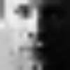
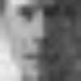

# mooney-reconstruction
This project restores photos of celebrities from Mooney photos, which are binarized
faces. In order to do this, a large training set of grayscale faces and Mooney faces is used.

Producing a face reconstruction from a binarized counterpart is a challenging high dimensional
problem, but it is shown that we can learn to do so from data. In particular, using the power
of Canonical Correlation Analysis (CCA), the dimensionality of the problem is reduced, by projecting 
the data into a subspace where the images are most correlated. Finally, ridge regression regression is used
to learn a mapping, from the projected binarized data to the grayscale images.

| Original | Mooney | Reconstructed |
| -------- |:------:|:------------- |
|  |  |  |

## Setup ##
**Installation:** ```sudo pip install -r requirements.txt``` <br />
**Run:** ```python mooney_reconstruction.py```
